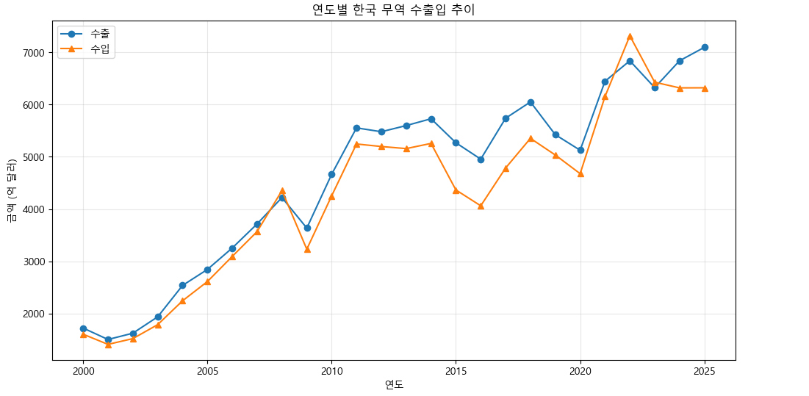
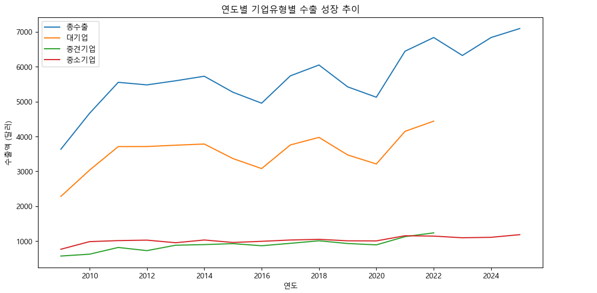
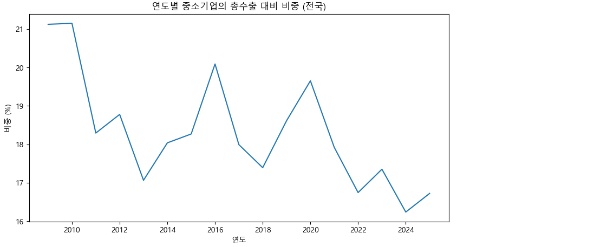

# GlobalGates

> **글로벌 무역 비즈니스 SNS 플랫폼**
> 
> 자유로운 피드 기반 SNS 와 B2B/B2C 무역 플랫폼입니다.

---

## 1. 기획 배경

### 한국 무역 시장은 성장하지만, 중소기업은 정체

- 한국 수출액은 2000년 약 **1,723억 달러** → 2025년 약 **7,093억 달러**로 25년간 **4배 이상 성장** (관세청 수출입무역통계)
- 그러나 성장의 대부분은 **대기업이 흡수**하며, 중소기업의 상대적 위치는 오히려 약화
- 중소기업 수출 비중: **2009년 21.1% → 2024년 16.2%** (약 -5%p)
- 중소기업의 절대 수출액은 768억 → 1,110억 달러로 늘었지만, 전체 시장에서의 점유율은 지속 하락

### 중소기업 해외진출의 1순위 애로사항 — 바이어 발굴

여러 조사에서 일관되게 같은 결론이 나옵니다.

- 국내 기업의 해외 진출 의지: **약 98%** — 한국제약바이오헬스케어연합회 제6차 포럼
- 한국무역협회: 서비스업 해외진출 애로사항 **1위 = "바이어 발굴"** (2020)
- 머니투데이: 벤처·스타트업 **72%**가 "해외 진출 시 바이어 발굴이 가장 어렵다"
- 2023년 중소기업 해외진출 실태조사: 바이어 정보 부족, 발굴 비용, 전문 인력 부족이 공통적 애로사항

수요(해외진출 의지 98%)는 충분히 있지만, **국내 중소기업과 해외 바이어를 연결할 효율적 채널이 부족**하다는 것을 확인할 수 있습니다.

### → GlobalGates

GlobalGates는 무역 기반 비즈니스 소셜 마켓 플랫폼으로, 국내 기업과 해외 바이어를 **피드 기반 SNS**형태로 직접 연결합니다. 

---

## 2. 데이터 분석 — 중소기업 수출 정체 확인

> **목적**: "한국 무역 시장은 성장하지만 중소기업은 정체된다"는 기획 가설을 KOSIS 공공데이터로 정량 검증

### 분석 데이터

| 데이터 | 활용 |
| --- | --- |
| 수출입 총괄 (2000~2025) | 전체 무역시장 성장 추이 확인 |
| 지역별 중소기업 수출 (2009~2025) | 기업 유형별 수출 비중 변화 |

`자료출처: KOSIS · 관세청`
---

### 한국 무역 시장은 25년간 4배 이상 성장

→ 2008년의 글로벌 규모의 경제위기, 2015년 시점의 경제위기와 더불어 메르스 창궐, 2019년의 코로나19로 인한 범지구적 경제적 위기를 겪은 연도를 제외하고는 대한민국의 수입수출 경제시장은 크게 성장. 2000년 약 **1,723억 달러** → 2025년 약 **7,093억 달러**로 4배 이상 확대.

---

### 성장의 대부분은 대기업이 흡수

→ 대기업 라인이 총 수출 라인과 거의 같은 기울기로 상승하는 반면, 중소기업·중견기업 라인은 1,000억 달러 부근에서 거의 정체. **시장 전체 성장의 대부분은 대기업이 흡수**하고 있음.

---

### 그에 반해 중소기업 비중은 오히려 감소

→ 2009년 **21.1%** → 2024년 **16.2%**로 약 **-5%p** 감소. 중소기업의 절대 수출액은 768억 → 1,110억 달러로 늘었지만, 시장 점유율 관점에서는 지속적으로 후퇴.

---

### 분석 결과

| 지표 | 2009년 | 2024년 |
| --- | --- | --- |
| 한국 총수출 | 약 3,635억 달러 | 약 6,836억 달러 |
| 중소기업 수출 | 약 768억 달러 | 약 1,110억 달러 |
| **중소기업 비중** | **21.1%** | **16.2%** |

→ 시장은 성장하지만 중소기업의 상대적 위치는 약화 → **바이어 발굴·시장 정보 비대칭 해소**가 문제인것을 볼 수 있었습니다.

---

## GlobalGates ERD

---

## 백엔드 담당업무

---

## 총평

### 기획

기획 단계에서는 흐름을 충분히 정리했다고 생각했지만, 막상 개발에 들어가니 미처 생각하지 못한 상황이 계속 나왔습니다.  
그때마다 다시 논의하고 수정하면서, 기능을 정의하는 것만이 기획이 아니라 사용자의 행동 경로와 예외까지 함께  
그려보는 것이 진짜 기획이라는 걸 배웠습니다. 모든 경우의 수를 미리 예측하긴 어렵지만, 그만큼 기획과 개발이 긴밀하게  
소통해야 한다는 점을 체감했습니다.

### 협업

처음에는 각자 맡은 부분에 집중하다 보니, 공통으로 영향을 주는 변경 사항이 제때 공유되지 않아 혼선이 생기기도 했습니다.  
이후 작은 변경이라도 바로 공유하고 짧게라도 의견을 맞추는 방식으로 바꾸면서 협업 속도가 눈에 띄게 좋아졌습니다.  
기술수준이 올라간 만큼, 정보를 공유하는 방법도 함께 발전해야 한다는 걸 배운 시간이었습니다.

### 좋았던 점

이전 프로젝트보다 훨씬 다양한 기술을 직접 경험할 수 있어 좋았습니다. FASTAPI 를 통한 AI 연동, Quartz 스케줄러,  
부트페이 결제 등 새로운 기술을 적용하고 배포까지 다뤄보면서, 단순히 코드만 작성하는 것을 넘어  
서비스가 실제로 어떻게 동작하고 운영되는지 전체적인 흐름을 이해할 수 있었습니다. 시야가 한 단계 넓어진 경험이었습니다.

### 아쉬웠던 점

기능 구현과 일정을 맞추는 데 집중하다 보니, 코드를 다듬거나 테스트를 충분히 챙기지 못한 점이 아쉽습니다. 
속도도 중요하지만 완성도와 기록 또한 그만큼 중요하다는 걸 느꼈습니다. 또한 사이트 내 공통적으로 쓰이는 
부분에 대해 기획 단계에서 팀원들과 의견을 더 공유했으면 어땠을까 하는 점도 기억에 남습니다.  
다음 프로젝트에서는 더 견고하고 유지보수하기 좋은 구조를 처음부터 고민하는 개발자로 성장하고 싶습니다.

---

#### 자료출처

- [한국무역협회 — 서비스 업계 해외진출 애로사항 1위 '바이어 발굴'](https://n.news.naver.com/mnews/article/421/0004811057?sid=101)
- [데일리메디 — 한국제약바이오헬스케어연합회 제6차 포럼](https://www.dailymedi.com/news/news_view.php?wr_id=907142)
- [머니투데이 — 벤처·스타트업 72% "바이어 발굴이 가장 어려워"](https://news.mt.co.kr/mtview.php?no=2022062815593839075)
- [2023년도 중소기업 해외진출 실태 및 애로사항 설문조사서 (PDF)](https://grant-documents.thevc.kr/196636_2023%EB%85%84%EB%8F%84+%EC%A4%91%EC%86%8C%EA%B8%B0%EC%97%85+%ED%95%B4%EC%99%B8%EC%A7%84%EC%B6%9C+%EC%8B%A4%ED%83%9C+%EB%B0%8F+%EC%95%A0%EB%A1%9C%EC%82%AC%ED%95%AD+%EC%84%A4%EB%AC%B8%EC%A1%B0%EC%82%AC%EC%84%9C.pdf)
